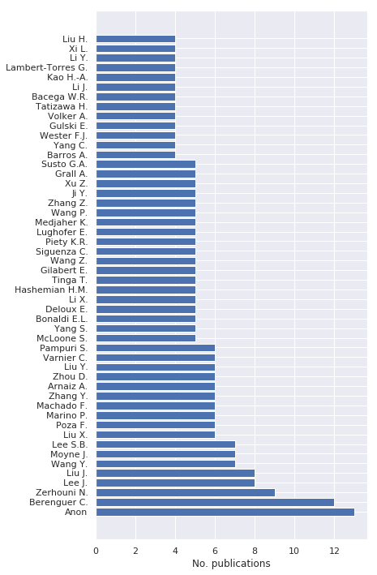
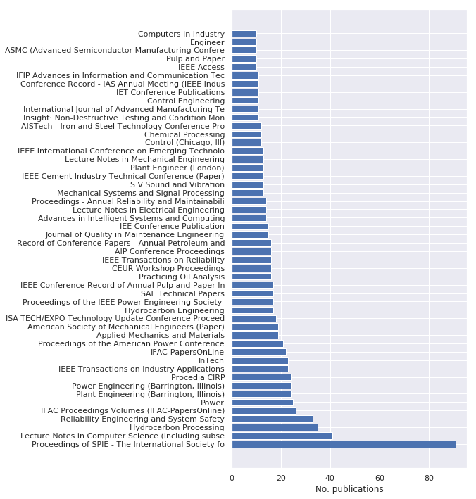
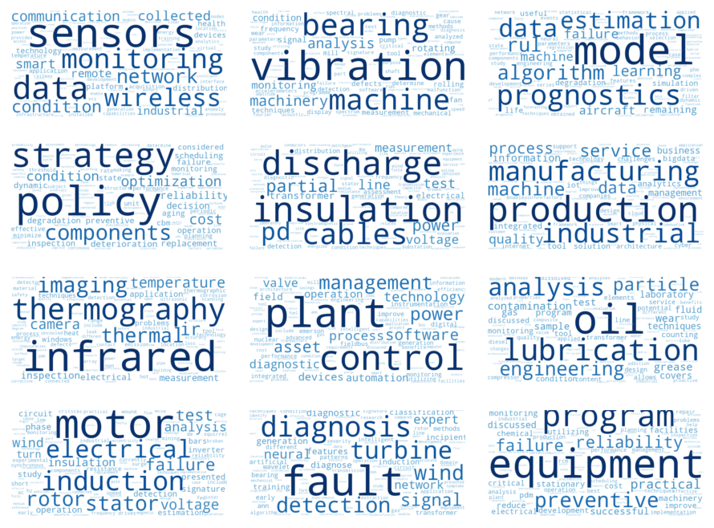
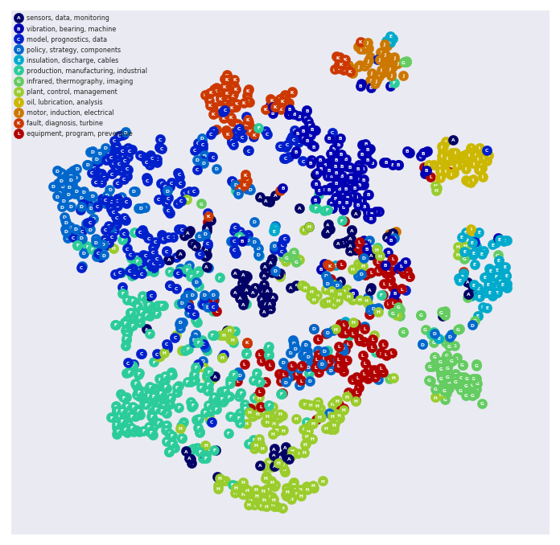

# Automated Literature Analysis 
This repository shows an example of how to perform an automated analysis of peer-reviewed literature using Jupyter notebooks and Scopus' citation database. This analysis shows the number of publications over time, popular authors, popular venues, popular affiliations, and popular "topics" that appear within the documents' abstracts (detected using natural language processing).

## Requirements
The notebook requires access to Scopus: A citation database of peer-reviewed literature from scientific journals, books, and conference proceedings. To utilize Scopus, you (or your institute) need a Scopus subscription and an Elsevier Developer API key (see [Elsevier Developers](https://dev.elsevier.com/sc_apis.html) and [Scopus Python API](https://scopus.readthedocs.io/en/latest/) for more information). 

The required Python packages can be found in `requirements.txt`. Creating a virtual Python environment is recommended (for example, `virtualenv` or `conda`). The notebook has been tested using Python 2.7 and Python 3.6. 

## Running the Notebook
After installing the dependencies, use `jupyter notebook literature_analysis.ipynb` to launch the notebook. Remaining instructions can be found within the notebook itself.

## Examples
Below are examples of the notebook's output for the query `title-abs-key("predictive maintenance")`.

